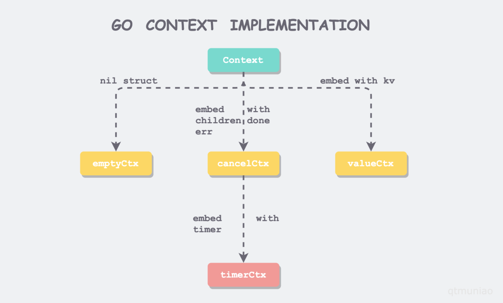

阅读笔记
===========================

## 为什么会出现context

当一个服务启动时，可能由此服务派生出多个多层级的 goroutine，但是本质上来讲每个层级的 goroutine 都是平行调度使用，不存在
goroutine“父子”关系，当其中一个 goroutine 执行的任务被取消了或者处理超时了，那么其他被启动起来的Goroutine 都应该迅速退出，另外多个多层的Goroutine 想传递请求域的数据该如何处理?

为了解决以上问题，Go1.7以来提供了 context 标准库来解决类似的问题，context 可以跟踪 Goroutine 的调用，在调用内部维护一个调用
树，通过这个调用树可以在传递超时或者退出通知，还能在调用树中传递元数据。我们可以理解为 context 管理了一组呈现树状结构的
Goroutine ,让每个Goroutine 都拥有相同的上下文,并且可以在这个上下文中传递数据
————————————————
版权声明：本文为CSDN博主「楚江云」的原创文章，遵循CC 4.0 BY-SA版权协议，转载请附上原文出处链接及本声明。
原文链接：https://blog.csdn.net/weixin_37717557/article/details/106949500

## 如何使用context

## context.go

### 结构图



### 上下文接口

```golang
type Context interface {
    // 如果Context设置了超时，Deadline会返回超时时限
	Deadline() (deadline time.Time, ok bool)
	// 返回只读channel，该channel被Context被取消或者被超时关闭
    Done() <-chan struct{}
    // 返回context结束时的出错信息
	Err() error
    // 返回nil或者对应key的值
	Value(key interface{}) interface{}
}
```

### 空实现
```golang
type emptyCtx int

func (*emptyCtx) Deadline() (deadline time.Time, ok bool) {
	return
}

func (*emptyCtx) Done() <-chan struct{} {
	return nil
}

func (*emptyCtx) Err() error {
	return nil
}

func (*emptyCtx) Value(key interface{}) interface{} {
	return nil
}
```

context.Background() 和 context.TODO() 返回的都是 emptyCtx 的实例。但其语义略有不同。前者做为 Context 树的根节点，后者
通常用在不知道什么时候传context的时候用。

```golang
var (
	background = new(emptyCtx)
	todo       = new(emptyCtx)
)

func Background() Context {
	return background
}

func TODO() Context {
	return todo
}
```