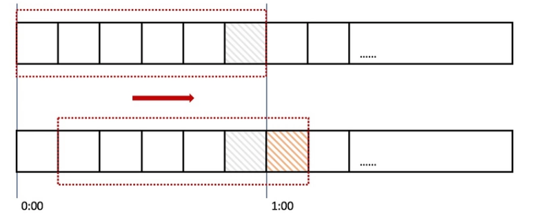

阅读笔记
=============================
## API限流

顾名思义，API限流就是限制用户访问的流量，通过对某段时间内访问次数的限制，保证系统的可用性和稳定性，防止访问量突然爆增导致系统响应
缓慢或者旦机。

常用的接口限流有计数器法、漏桶算法(Leaky Bucket)和令牌桶算法(token bucket)。

本文介绍的API限流器，将基于令牌桶算法实现。不过，在介绍实现之前，先介绍一下这几个常用的算法。

## API限流器算法

### 计数器法

计数器法是限流器中最简单的一种算法。比如我们规定，对于A接口来说，我们1分钟的访问次数不能超过100个。那么我们可以这么做：在一开始的
时候，我们可以设置一个计数器counter，每当一个请求过来的时候，counter就加1，如果counter的值大于100并且该请求与第一个请求的间
隔时间还在1分钟之内，那么说明请求数过多。

计数器算法很简单，但是有个严重的bug。

一个恶意用户在0:59时瞬间发送了100个请求，然后再1:00时又瞬间发送了100个请求，那么这个用户在2秒内发送了200个请求。

上面我们规定1分钟最多处理100个请求，也就是每秒1.7个请求。用户通过在时间窗口的重置节点处突发请求，可以瞬间超过系统的承载能力，
导致系统挂起或宕机。

上面的问题，其实是因为我们统计的精度太低造成的。那么如何很好地处理这个问题呢？或者说，如何将临界问题的影响降低呢？我们可以看下面的**滑动窗口算法**。



上图中，我们把一个时间窗口（一分钟）分成6份，每份（小格）代表10秒。每过10秒钟我们就把时间窗口往右滑动一格， 每一个格子都有自己独
立的计数器。

比如一个请求在0:35秒到达的时候，就会落在0:30-0:39这个区间，并将此区间的计数器加1。

从上图可以看出, 0:59到达的100个请求会落在0:50-0:59这个灰色的格子中, 而1:00到达的100个请求会落在黄色的格子中。

而在1:00时间统计时， 窗口会往右移动一格，那么此时的时间窗口内的请求数量一共是200个，超出了限制的100个，触发了限流，后面的100个
请求被抛弃或者等待。

如果我们把窗口时间划分越多，比如60格，每格1s，那么限流统计会更精确。

### 漏桶算法(Leaky Bucket)

有一个固定容量的桶，有水(请求)流进来，漏桶以一定的速度出水。对于流进来的水来说，我们无法预计一共有多少水会流进来，也无法预计水流的速度。但是对于流出去的水来说，这个桶可以固定水流出的速率。当桶满了之后，多余的水将会溢出(多余的请求会被丢弃)。

因为漏桶的漏出速率是固定的参数，所以，即使网络中不存在资源冲突(没有发生拥塞)，漏桶算法也不能使流突发(burst)到端口速率。因此，漏
桶算法对于存在突发特性的流量来说缺乏效率。而令牌桶算法允许流量一定程度的突发。因为默认的令牌桶算法，取走token是不需要耗费时间的，
也就是说，假设桶内有100个token时，那么可以瞬间允许100个请求通过。

### 令牌桶算法(Token Bucket)

令牌桶算法比漏桶算法稍显复杂。首先，我们有一个固定容量的桶，桶里存放着令牌（token）。桶一开始是空的(可用token数为0)，token以一
个固定的速率r往桶里填充，直到达到桶的容量，多余的令牌将会被丢弃。每当一个请求过来时，就会尝试从桶里移除一个令牌，如果没有令牌的
话，请求无法通过。

## 基于令牌桶的API限流器实现思路
想象有一个木桶，木桶的大小有限，有人按一定的速率往木桶里面放置令牌。

如果用户想访问API，就需要往木桶拿取令牌，如果木桶没有令牌，用户就无法访问API，理论上，系统支持的最大并发量就是木桶的大小。

而这，就是基于令牌桶实现的API限流器的思路。

限流器对外暴露的用来消费token的接口主要有三种方式，他们的作用都是消费 N 个Token，以下为他们的差异。

    AllowN：消费N个Token，如果桶里面有N个Token，消费成功，返回true，否则消费失败，返回false

    ReserveN：调用完成后，返回一个Reservation*对象。用户可以调用该对象的 Delay() 方法，该方法返回了需要等待的时间。如果等待时间为0，说明不用等待。否则必须等到等待时间之后，才能进行接下来的工作。或者，如果不想等待，可以调用Cancel()方法，该方法会将Token归还。
    
    WaitN：当使用Wait方法消费Token时，如果桶内Token数组不足(小于N)，那么Wait方法将会阻塞一段时间，直至Token满足条件。如果充足则直接返回。我们可以设置context的Deadline或者Timeout，来决定此次Wait的最长时间

从源码中可以发现，以上三种方法的实现最终都调用了reserveN，在本文中，将采取自底向上的方法，从reverseN开始分析，然后再介绍AllowN、ReserveN和WaitN。

## reserveN
再讲解reserveN之前，需要先了解以一下限流器的结构，限流器定义如下
```golang
type Limiter struct {
	mu        sync.Mutex
	limit     Limit     // 表示一秒内生成token的速率
	burst     int       // 桶的大小
	tokens    float64   // 现在桶内有多少token
	last      time.Time // 上一次token被取走的时间
	lastEvent time.Time // 上一次发生限流事件的时间
}
```
reserveN表示向限流器申请N个令牌，其令牌申请的结构体如下。
```golang
type Reservation struct {
	ok        bool  // 申请令牌是否成功
	lim       *Limiter
	tokens    int   // 申请的tokens数目
	timeToAct time.Time
	// This is the Limit at reservation time, it can change later.
	limit Limit // 申请令牌时API限流器生成token的速率
}
```
接下来将介绍本节的重点，reserveN函数，reserveN表示向限流器申请N个令牌
```golang
func (lim *Limiter) reserveN(now time.Time, n int, maxFutureReserve time.Duration) Reservation {
    // 先从参数开始介绍
    // now 表示申请令牌时的事件
    // n 表示申请令牌的个数
    // maxFutureReserve 表示申请最长等待事件，因此申请时可能木桶里面的令牌还不够，所以可能需要等待
	lim.mu.Lock()
	defer lim.mu.Unlock()
    // 如果限流器生成令牌的速率为无穷
    // 那么对于任意令牌的申请，都能满足
	if lim.limit == Inf {
		return Reservation{
			ok:        true,
			lim:       lim,
			tokens:    n,
			timeToAct: now,
		}
	} else if lim.limit == 0 {
        // 如果限流器生成令牌的速率为0
        // 那么限流器能否满足令牌的申请，只能看木桶剩下的令牌了
		var ok bool
		if lim.burst >= n {
			ok = true
			lim.burst -= n
		}
		return Reservation{
			ok:        ok,
			lim:       lim,
			tokens:    lim.burst,
			timeToAct: now,
		}
	}
    // now : 现在的事件
    // last : 上次拿token的事件
    // tokens : 从上次到现在，限流器生成的token数目与限流器本身木桶里token数目之和
    // 注意： 由于限流器生成token的速率一定，因此，我们可以通过时间差，算出这段时间生成的token数目
	now, last, tokens := lim.advance(now)

	// 减去请求的token数目，如果tokens小于0，说明需要等待，算出等待时间
	tokens -= float64(n)
	var waitDuration time.Duration
	if tokens < 0 {
		waitDuration = lim.limit.durationFromTokens(-tokens)
	}

	// 请求是否能申请成功，由木桶里面桶大小和用户所能容忍的最长申请时间决定
	ok := n <= lim.burst && waitDuration <= maxFutureReserve
    // 填充Reservation结构体，用以返回
	r := Reservation{
		ok:    ok,
		lim:   lim,
		limit: lim.limit,
	}
	if ok {
		r.tokens = n
		r.timeToAct = now.Add(waitDuration)
	}

	// 更新限流器状态
	if ok {
		lim.last = now
		lim.tokens = tokens
		lim.lastEvent = r.timeToAct
	} else {
		lim.last = last
	}

	return r
}
```
## AllowN
```golang
func (lim *Limiter) AllowN(now time.Time, n int) bool {
	return lim.reserveN(now, n, 0).ok
}
```
可以看到，AllowN的实现就是简单调用了以下reserveN函数，由于比较简单，不多叙述。

## ReserveN
```golang
func (lim *Limiter) ReserveN(now time.Time, n int) *Reservation {
	r := lim.reserveN(now, n, InfDuration)
	return &r
}
```
可以看到，ReserveN的实现也是简单调用了以下reserveN函数，与AllowN不同的是，其调用reserveN的参数中，用户最大等待时间为无穷，且返回的不是布尔值，而是令牌申请结构体。
## WaitN
```golang
func (lim *Limiter) WaitN(ctx context.Context, n int) (err error) {
	lim.mu.Lock()
	burst := lim.burst  // 木桶的大小
	limit := lim.limit  // 生成令牌的速率
	lim.mu.Unlock()

	if n > burst && limit != Inf {
		return fmt.Errorf("rate: Wait(n=%d) exceeds limiter's burst %d", n, burst)
	}
	// 如果context已经被cancel掉，那么返回error
	select {
	case <-ctx.Done():
		return ctx.Err()
	default:
	}
	// Determine wait limit
	now := time.Now()
	waitLimit := InfDuration
	if deadline, ok := ctx.Deadline(); ok {
        // 再经过waitLimit时间，context就会到deadline
        // i.e waitLimit就是申请令牌的最大容忍时间
		waitLimit = deadline.Sub(now)
	}
	// 调用reserveN，申请N个令牌
	r := lim.reserveN(now, n, waitLimit)
	if !r.ok {
		return fmt.Errorf("rate: Wait(n=%d) would exceed context deadline", n)
	}
	// 再过delay时间，就能拿到令牌
	delay := r.DelayFrom(now)
	if delay == 0 {
		return nil
	}
    // 申请一个timer，等待delay时间，返回
	t := time.NewTimer(delay)
	defer t.Stop()
	select {
	case <-t.C:
		// 时间到，返回
		return nil
	case <-ctx.Done():
		// delay时间还未到，context就已经被done了，返回error
		r.Cancel() // 取消令牌申请结构体，归还token
		return ctx.Err()
	}
}
```

## 其他函数

在代码中出现的其他函数，本文将不再一一讲解，建议以上文介绍过的函数为提纲，当上述函数调用了其他函数时，再去仔细查看其实现，本人已经在代码中其他函数加入了注释。

## 疑问

CancelAt(now time.Time) 表示放弃消费一个令牌预约结构体，在阅读该函数其实现时

```golang
restoreTokens := float64(r.tokens) - r.limit.tokensFromDuration(r.lim.lastEvent.Sub(r.timeToAct))
```
其需要归还的令牌数目，除了令牌预约结构体本身的令牌数目外，还需要减去**r.limit.tokensFromDuration(r.lim.lastEvent.Sub(r.timeToAct))**，这令我感到十分困惑，在网上也未找到比较合理的解释，希望有大佬能为我解惑。